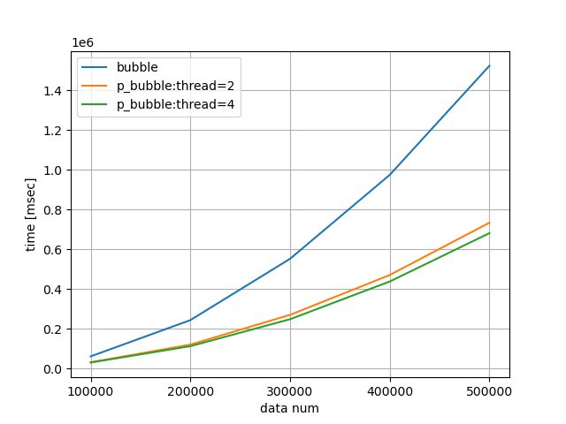

# Implementation of multi-thread bubble sort (C++11)

## How to run?
As a first step, please compile source codes.
I always create makefile, therefore,
```
make
```
is enough. Then, "bubble" and "p_bubble" are created.
In this implementation, to handle any number of threads, I adopt thread pool for efficiently using multi threads (Because if don't use thread pool, needs creation and deletion of thread many times. But this is too cost).

Examples  of execution command,
```
./bubble 10000
./p_bubble 10000 2
```

Additionally, for comparison, python3 is used.
Please command,
```
python3 bubble_plot.py
```
Then, result image is generated.

Following is a result in my environment.


|data num | time [msec] <br>single thread | time [msec] <br>thread = 2 | time [msec] <br>thread = 4|
| :---:| :---:| :---:| :---:|
|100000|61176|31547|30313|
|200000|243516|120371|112486|
|300000|551896|269915|248049|
|400000|973936|470382|437734|
|500000|1522730|733471|680901|
