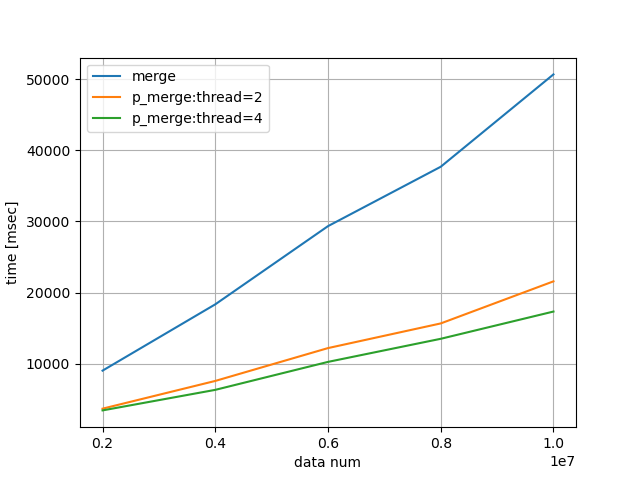

# Implementation of multi-thread merge sort (C++11)

## How to run?
As a first step, please compile source codes.
I always create makefile, therefore,
```
make
```
is enough. Then, "merge" and "p_merge" are created.
Here, "merge" is single thread merge sort and "p_merge" is multi-thread merge sort
(In this Implementation, "divide" parts are multi-thread).

Examples  of execution command,
```
./merge 10000
./p_merge 10000 2
```

Additionally, for comparison, python3 is used.
Please command,
```
python3 merge_plot.py
```
Then, result image is generated.

Following is a result in my environment.



|data num | time [msec] <br>single thread | time [msec] <br>thread = 2 | time [msec] <br>thread = 4|
| :---:| :---:| :---:| :---:|
|2000000|9022|3677|3433|
|4000000|18340|7574|6320|
|6000000|29331|12191|10251|
|8000000|37677|15657|13497|
|10000000|50657|21570|17326|
