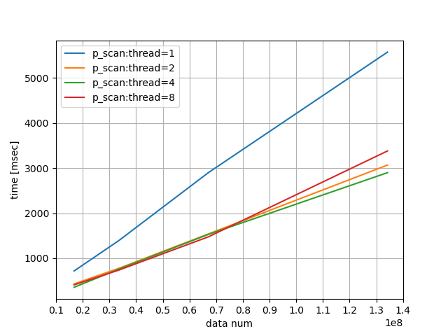

# Implementation of multi-thread(parallel) prefix-sum (C++11)

## How to run?
As a first step, please compile source codes.
I always create makefile, therefore,
```
make
```
is enough. Then, "scan" and "p_scan" are created.
Here, "scan" is naive implementation of prefix sum and "p_scan" is multi-thread(parallel) prefix sum, and OpenMP is used for parallelization.

Examples  of execution command,
```
./scan 10000
./p_scan 10000 2
```

Additionally, for comparison, python3 is used.
Please command,
```
python3 merge_plot.py
```
Then, result image is generated.

Following is a result in my environment.



|data num | time [msec] <br>single thread | time [msec] <br>thread = 2 | time [msec] <br>thread = 4| time [msec] <br>thread = 8|
| :---:| :---:| :---:| :---:| :--: |
|16777216|717|429|355|409|
|33554432|1392|776|758|737|
|67108864|2900|1539|1529|1475|
|134217728|5575|3068|2899|3381|
